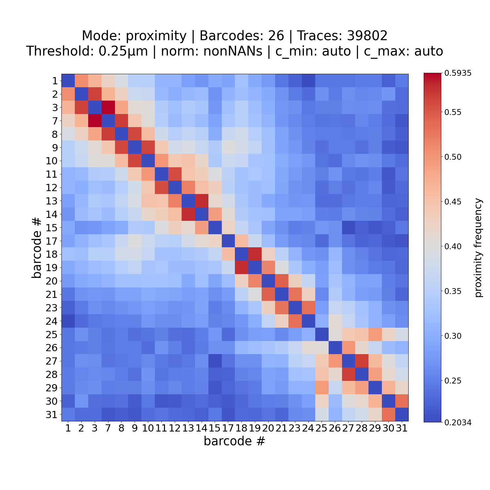
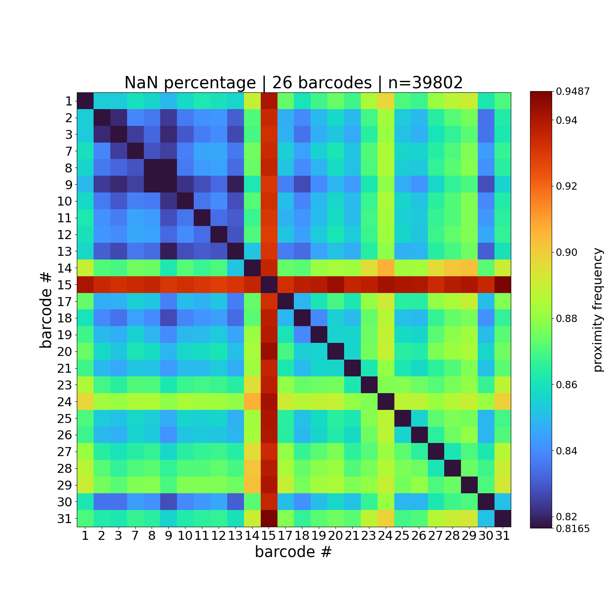

# figure_him_matrix

```{eval-rst}
.. argparse::
   :ref: traceratops.figure_him_matrix.parse_arguments
   :prog: figure_him_matrix
```


## Example

Here is an example usage of figure_him_matrix:

```bash 
figure_him_matrix -M PWDscMatrix.npy -B unique_barcodes.ecsv --norm 
```


