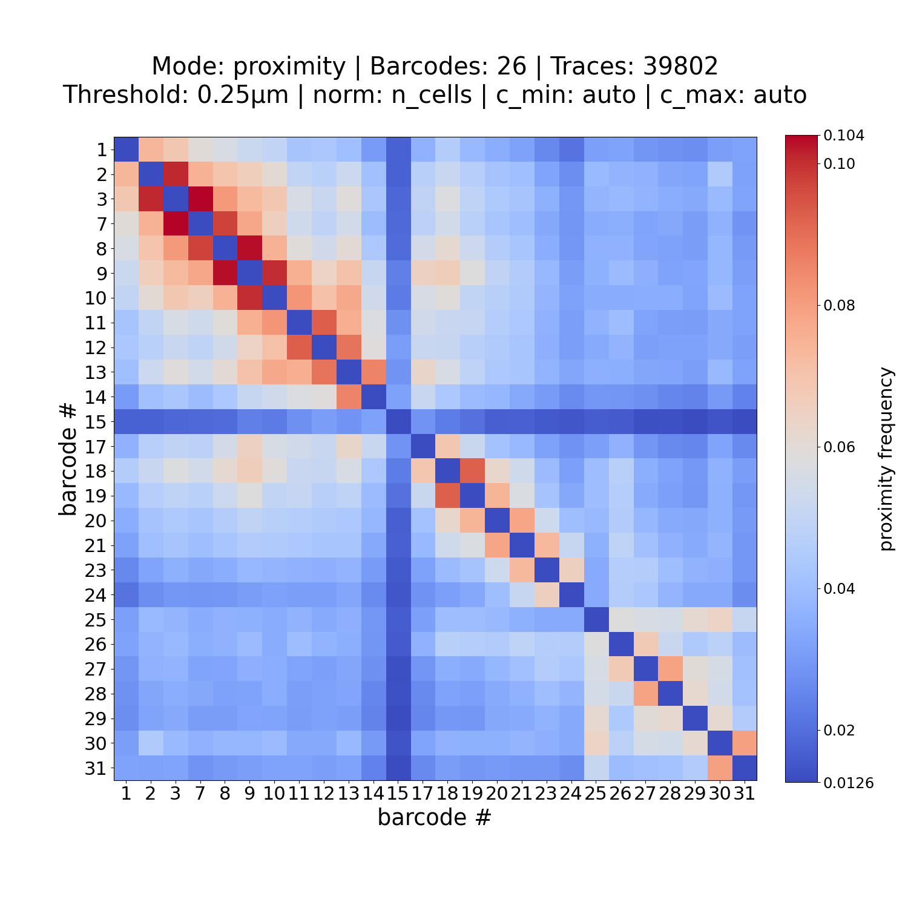
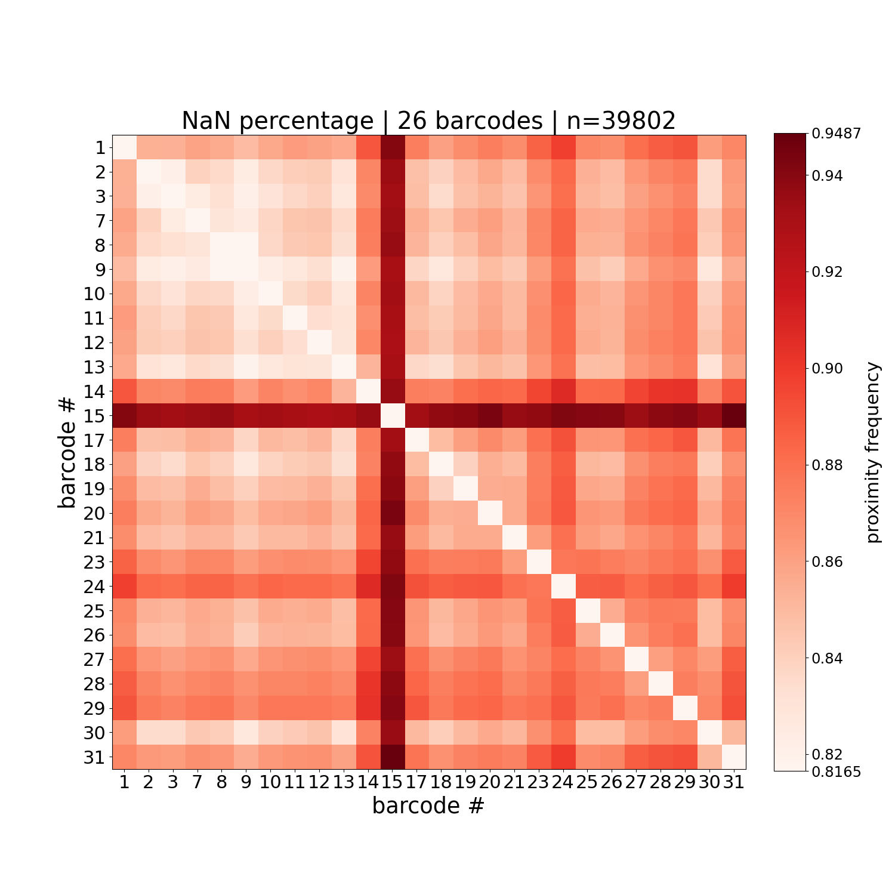
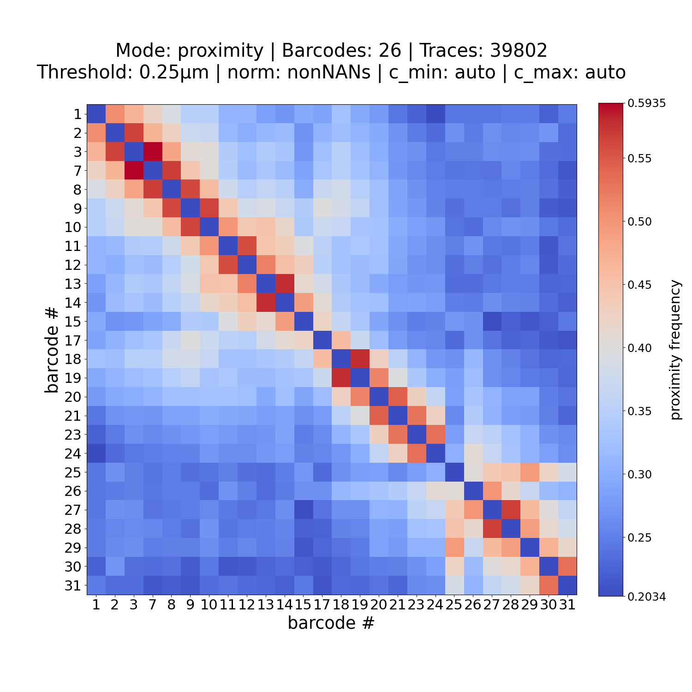
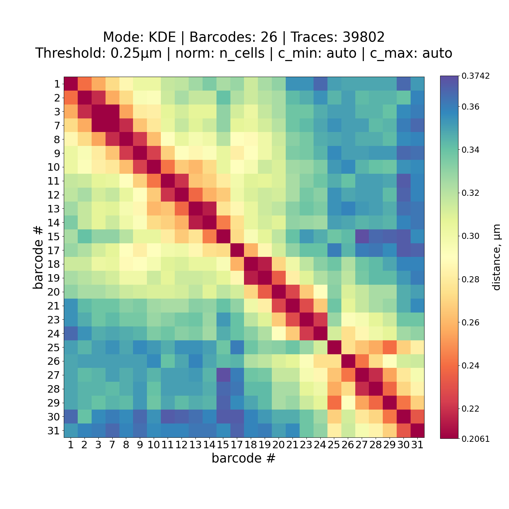

# figure_him_matrix

```{eval-rst}
.. argparse::
   :ref: traceratops.figure_him_matrix.parse_arguments
   :prog: figure_him_matrix
```


## Example

Here is examples usage of figure_him_matrix:

### Default (proximity)
```bash
figure_him_matrix -M PWDscMatrix.npy -B unique_barcodes.ecsv
```

<p align="center">
    
    
</p>


### Default normalized VS. KDE (c_map: Spectral)


```bash
figure_him_matrix -M PWDscMatrix.npy -B unique_barcodes.ecsv --remove_nan
```

**VS.**

```bash
figure_him_matrix -M PWDscMatrix.npy -B unique_barcodes.ecsv --mode KDE --c_map Spectral
```

<p align="center">
    
    
</p>
