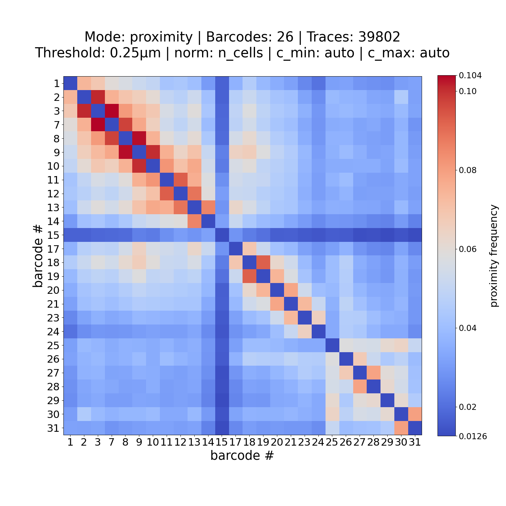
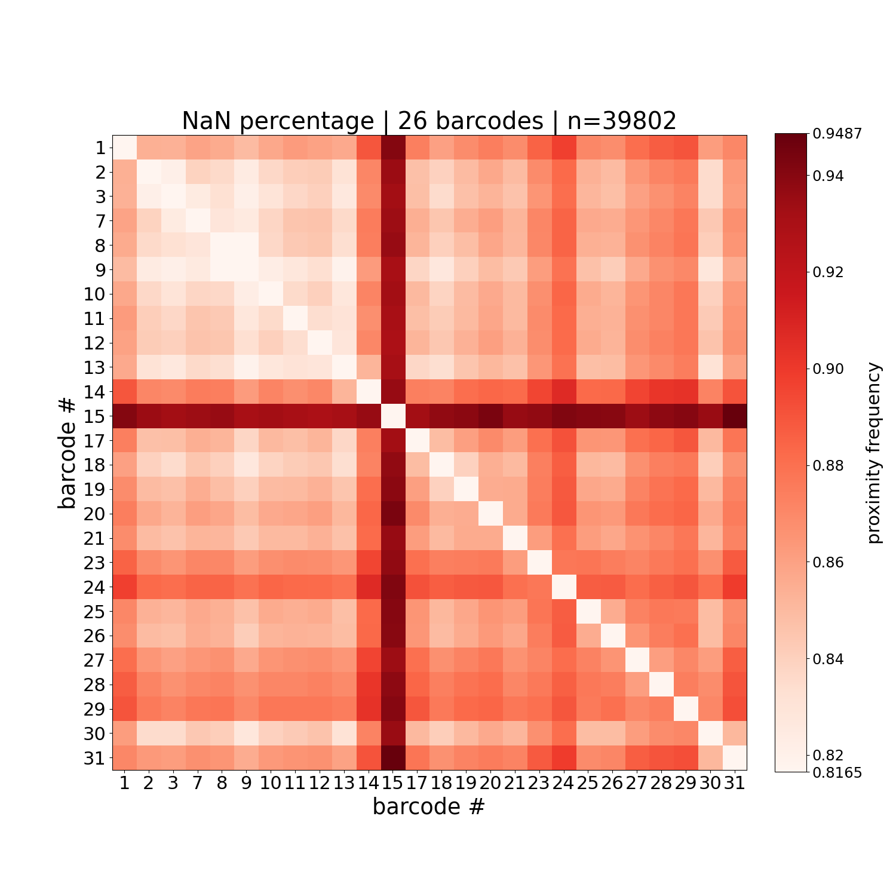
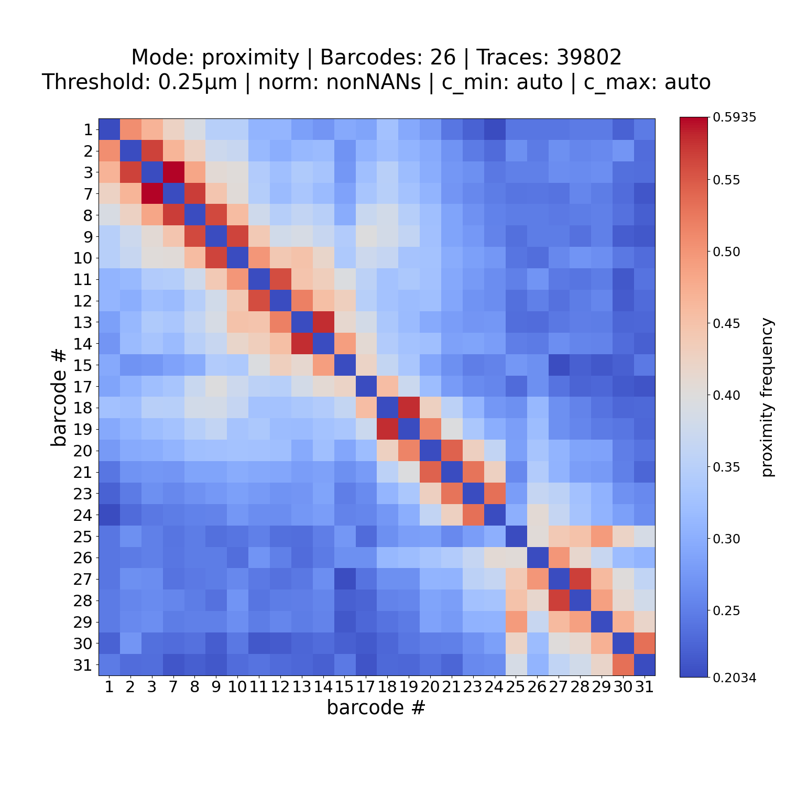
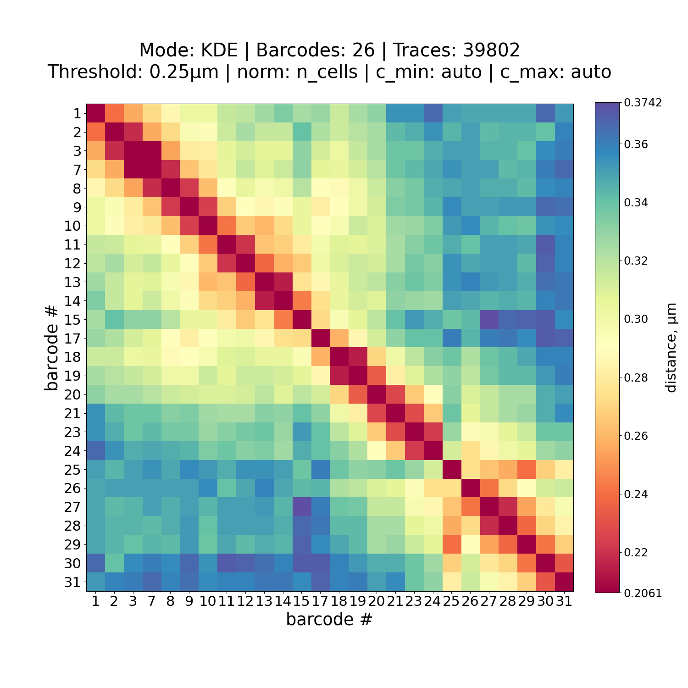

# plot_him_matrix

**Reliability status**: `stable`

```{eval-rst}
.. argparse::
   :ref: traceratops.plot_him_matrix.parse_arguments
   :prog: plot_him_matrix
```

## Output Files

The script generates:

1. `[output]/Fig_[matrixfile]_[mode][_norm][_Tthreshold]_[c_min]-[c_max].[format]`: Matrix visualization for the selected mode (`proximity`, `median`, or `KDE`). The `_norm` component is included when normalization removes NaN values, and `_Tthreshold` is included when a non-default proximity threshold is used.

2. `[output]/Fig_[matrixfile]_[mode][_norm][_Tthreshold]_[c_min]-[c_max].npy`: NPY file containing the plotted matrix values.

3. `[output]/Fig_[matrixfile]_nan[_norm]_[c_min]-[c_max].[format]`: NaN-percentage matrix plot. This file is written when `--mode proximity` is used.

## Examples

Here is examples usage of plot_him_matrix:

### Proximity matrix with all data (including bin with NaN value)
```bash
plot_him_matrix --input PWDscMatrix.npy --barcodes unique_barcodes.ecsv --matrix_norm_mode n_cells
```

<p align="center">
    
    
</p>


### Default normalized VS. KDE (cmap: Spectral)


```bash
plot_him_matrix --input PWDscMatrix.npy --barcodes unique_barcodes.ecsv
```

**VS.**

```bash
plot_him_matrix --input PWDscMatrix.npy --barcodes unique_barcodes.ecsv --mode KDE --cmap Spectral
```

<p align="center">
    
    
</p>

## Notes

- See the command-line reference above for the complete option list.
