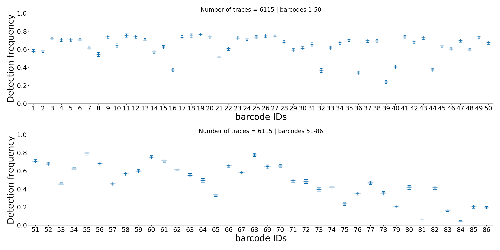
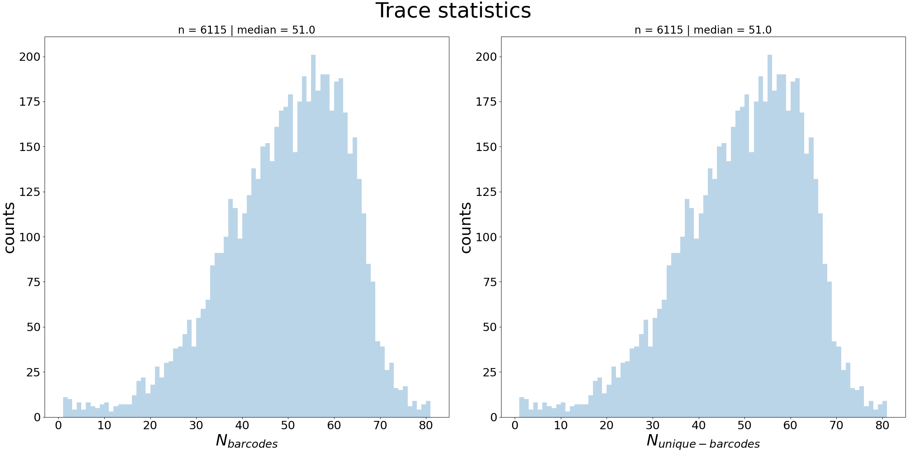
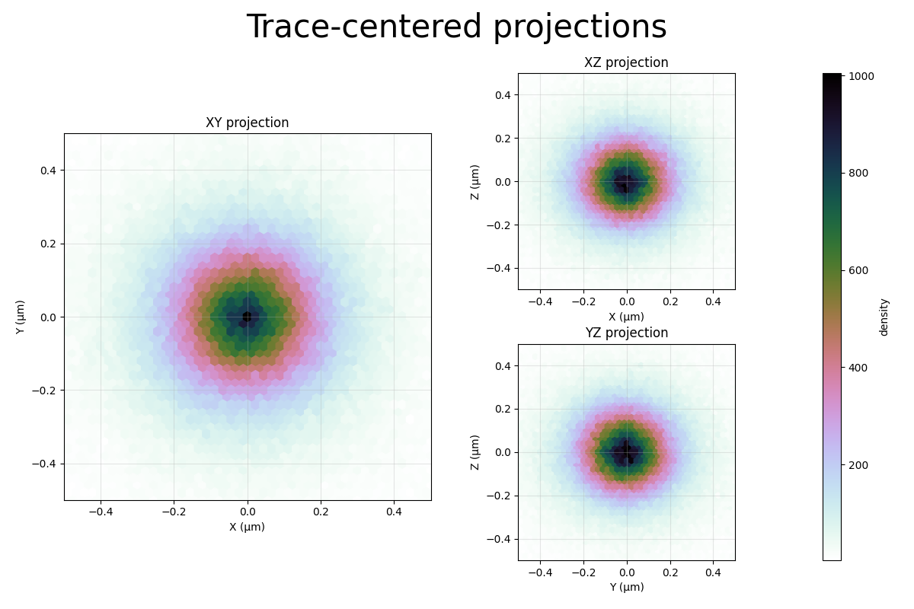
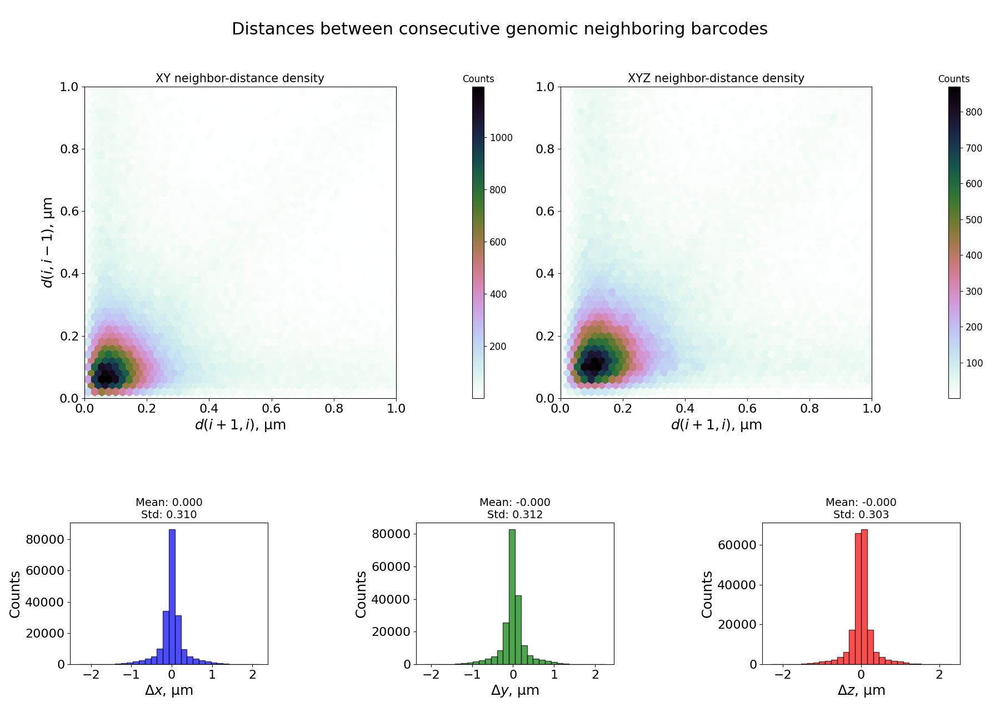

# trace_analyzer

**Reliability status**: `stable`

```{eval-rst}
.. argparse::
   :ref: traceratops.trace_analyzer.parse_arguments
   :prog: trace_analyzer
```

## Output Files

For each trace file analyzed, the script generates:

1. `[tracefile]_relative_barcode_frequencies.[format]`: Number of barcodes per trace, for each separate barcode. If only the top row is occupied, barcodes are present only once per trace. The second row represents the number of times barcodes are present twice in the trace, and so on.
[](../../_static/merged_traces_relative_barcode_frequencies.png)

2. `[tracefile]_barcode_detection.[format]`: Plot of barcode detection efficiency. Errorbars are obtained by bootstrapping.


3. `[tracefile]_trace_statistics.[format]`: Histograms of number of barcodes per trace.
!

4. `[tracefile]_kde_projections.[format]`: Traces are translated to their center of mass and reprojected along XY, XZ and YZ.


5. `[tracefile]_first_neighbor_distances.[format]`: Top plots represent the histogram of distances between next and previous neighbour for each barcode in the trace, for all traces, in XY and in XYZ. Bottom plots show histograms of distances between consecutive genomic barcodes in X, Y and Z.



## Examples

```bash
# Analyze a single trace file
trace_analyzer --input path/to/your/trace_file.ecsv

# Analyze multiple trace files using pipe
find /path/to/traces -name "*.ecsv" | trace_analyzer --pipe

# Specify a different root folder
trace_analyzer --rootFolder /custom/data/folder --input trace_file.ecsv

# Generate SVG output instead of PNG
trace_analyzer --input trace_file.ecsv --format svg

# Generate XYZ plots in addition to statistics
trace_analyzer --input trace_file.ecsv --plotXYZ
```

## Notes

- See the command-line reference above for the complete option list.
