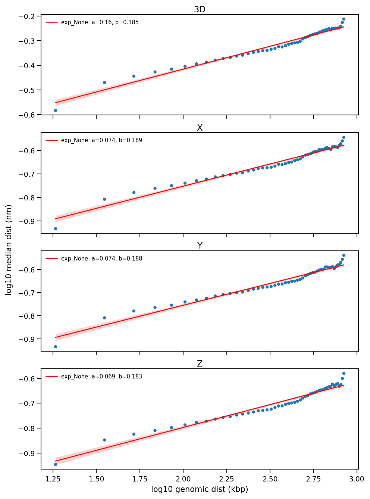

# trace_physical_vs_genomic_distance

**Reliability status**: `stable`

```{eval-rst}
.. argparse::
   :ref: traceratops.trace_physical_vs_genomic_distance.parse_arguments
   :prog: trace_physical_vs_genomic_distance
```

## Output Files

For each trace file analyzed, the script generates:

1. `[output].csv`: CSV file containing one row per genomic-distance bin and axis. The filename comes from `--output`.

2. `[interloci_output].csv`: Optional CSV file containing genomic distances between consecutive barcode loci. This file is written only when `--interloci_output` is provided.

3. `[tracefile]_physical_vs_genomic_plot.png`: Figure with the physical-versus-genomic distance plot, power-law fit, and confidence intervals. The suffix comes from `--plot` (default: `_physical_vs_genomic_plot.png`).



## Examples

```bash
trace_physical_vs_genomic_distance.py \
  --input traces_KC_AB_merged.ecsv \
  --output binned_physical_vs_genomic_distances.csv \
  --interloci_output interloci_genomic_distances.csv \
  --plot _physical_vs_genomic_plot.png \
  --gen_dist_bins 50 \
  --dist_threshold 1000 \
  --experiment KC_AB
```

The plot filename is appended to the input stem by default. For the example above, the figure is saved as `traces_KC_AB_merged_physical_vs_genomic_plot.png`.

## Notes

### Plot and power-law fit

When `--plot` is provided, the script saves a stacked log-log plot with one panel per calculated axis. The x-axis is shared and shown only on the bottom panel, while a single shared y-axis label spans the panels to avoid label overlap.

For every axis panel and experiment, the script fits the binned median distances to a power-law model:

```text
physical_distance = a * genomic_distance^b
```

The fit is performed by linear regression in log10 space. The plotted fit line is shown together with a 95% confidence interval for the fitted mean response. Each panel legend reports both fitted coefficients:

- `a`: the scale coefficient.
- `b`: the power-law exponent.


- See the command-line reference above for the complete option list.
