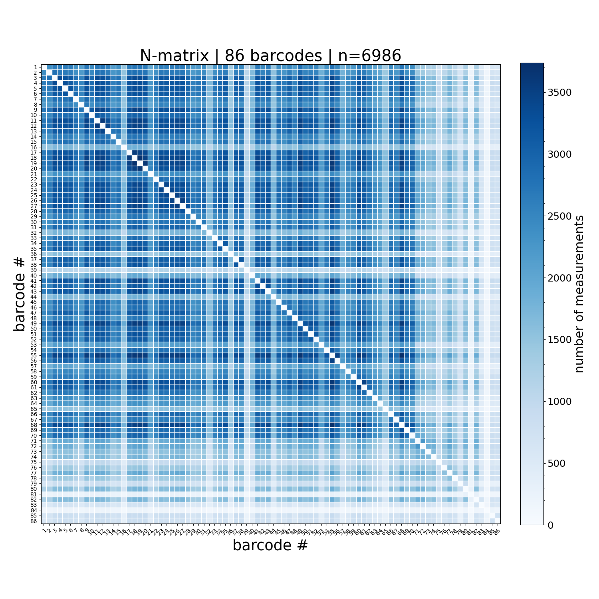
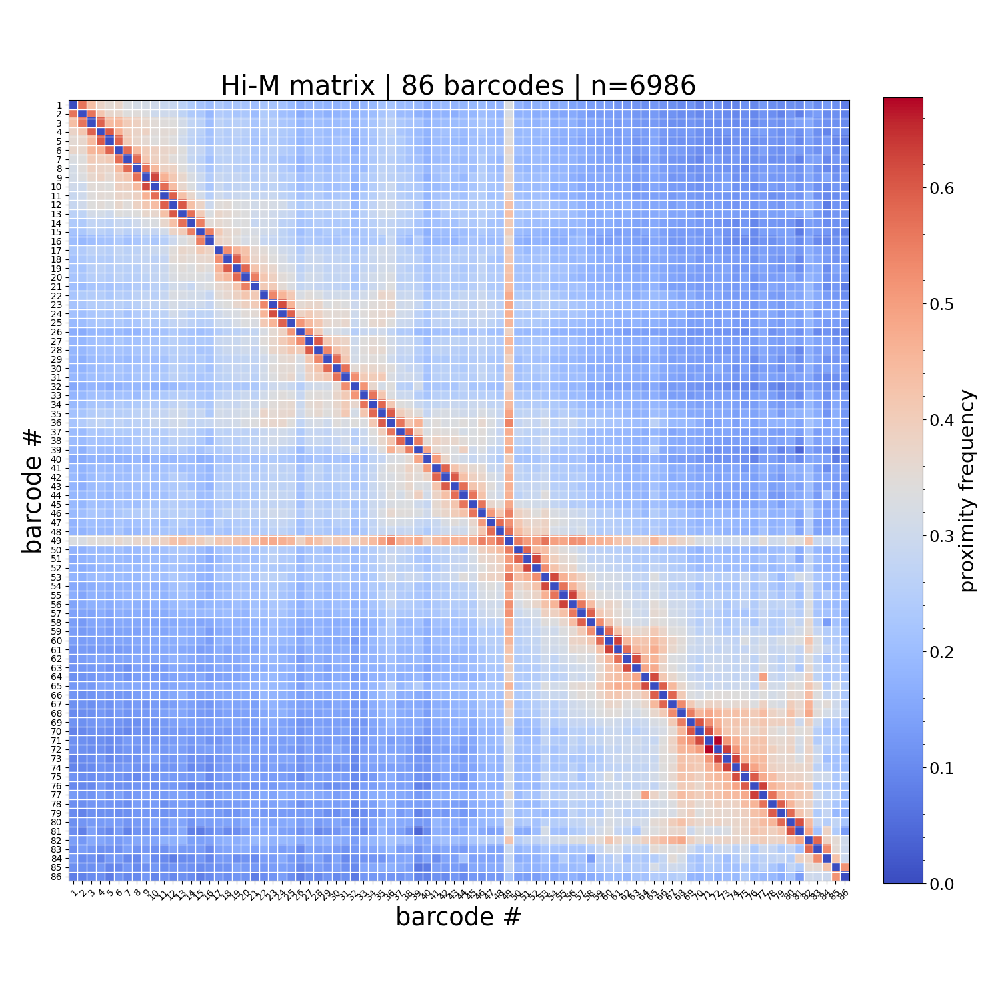
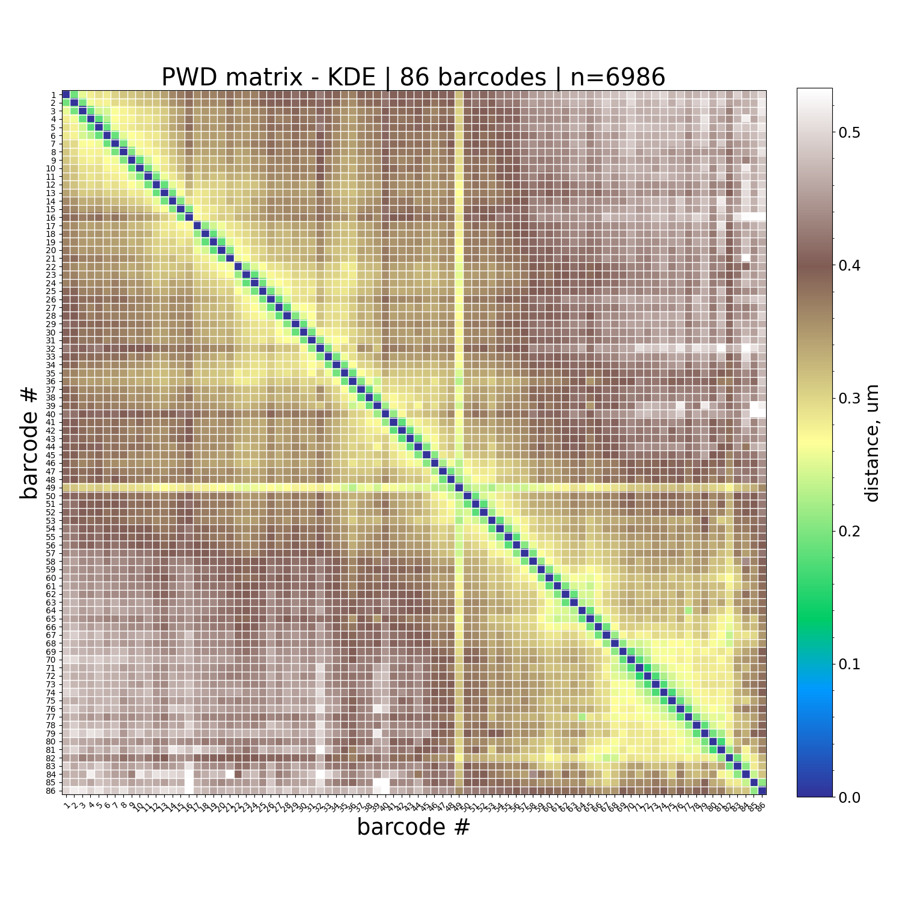
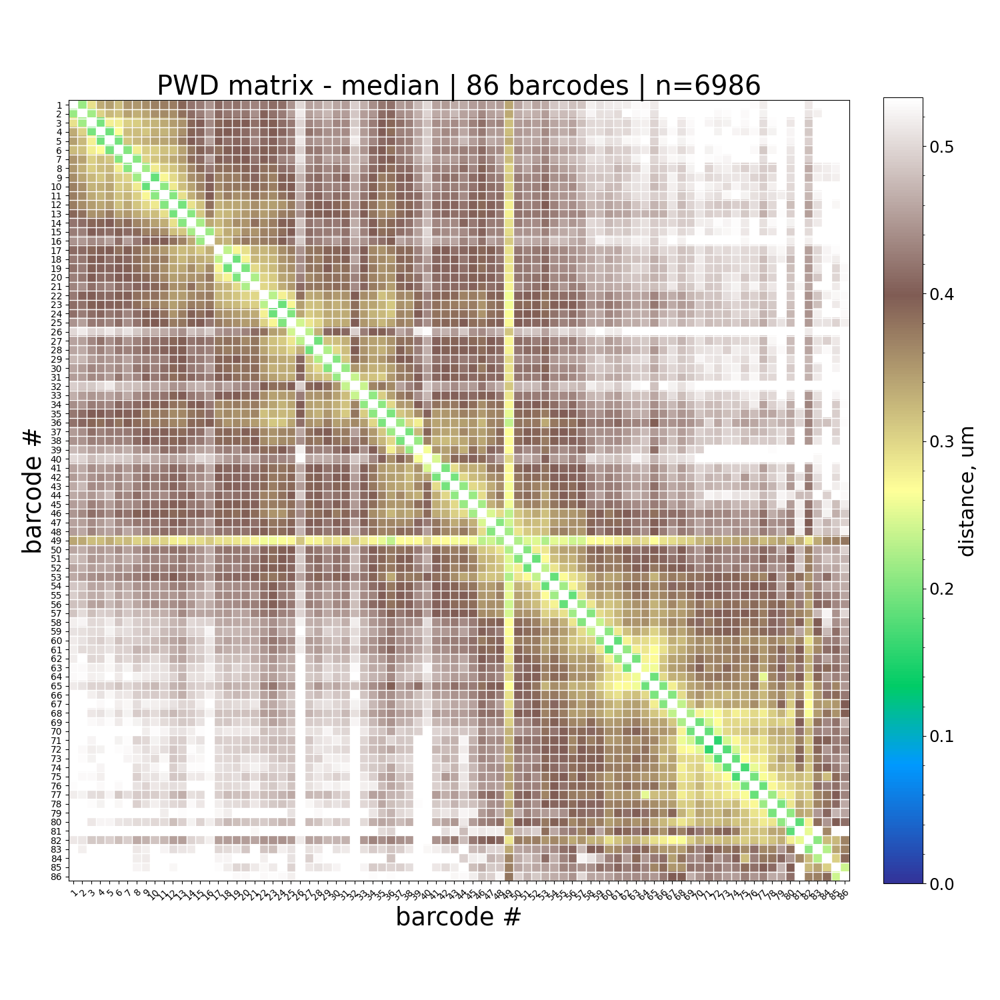

# trace_to_matrix

**Reliability status**: `stable`

```{eval-rst}
.. argparse::
   :ref: traceratops.trace_to_matrix.parse_arguments
   :prog: trace_to_matrix
```

## Output Files

For each trace file analyzed, the script generates:

1. `[tracefile]_Matrix_PWDscMatrix.npy`: NUMPY single-cell pairwise-distance matrix.

2. `[tracefile]_Matrix_uniqueBarcodes.ecsv`: Unique barcode list in ECSV format.

3. `[tracefile]_Matrix_Nmatrix.npy`: NUMPY matrix containing the number of times each barcode pair is detected.

4. `[tracefile]_Matrix_Nmatrix.png`: Plot of the N-matrix.



5. `[tracefile]_Matrix_HiMmatrix.png`: Hi-M contact matrix calculated using a fixed threshold (default: 0.25 microns).



6. `[tracefile]_Matrix_PWDmatrixKDE.png`: PWD KDE matrix plot.



7. `[tracefile]_Matrix_PWDmatrixMedian.png`: PWD median matrix plot.



8. `[tracefile]_Matrix_PWDhistograms.png`: Optional figure with distance distributions for each barcode pair. This file is written only when `--plot_histograms` is provided.

## Examples

```bash
trace_to_matrix --help
```

## Notes

- See the command-line reference above for the complete option list.
